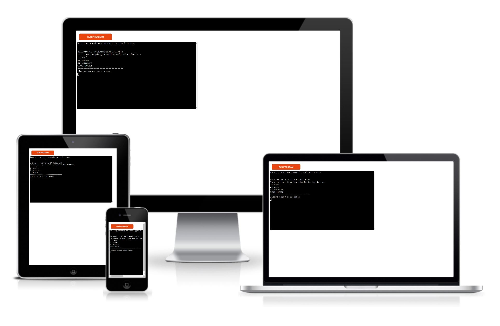

# Rock-Paper-Scissors

Rock-Paper-Scissors is a Python terminal game. I's been deployed on Heroki and runs in the Code Institute mock terminal.

Within this terminal, once users have run the program, they will can play to the clasic Rock, Paper and Scissors game against the computer.

Users must enter their user name and the number of rounds they want to play before start the game.

After playing the chosen rounds ny the user, the final score will be printed out with the due winner. In order to restart the game, the program must be re-run again.

# Table of Contents

- [How to play](#how-to-play)
- [User Stories](#user-stories)
- [Features](#features)
- [Future features](#future-features)
- [Typography and colour scheme](#typography-and-colour-scheme)
- [Wireframes](#wireframes)
- [Technologies](#technologies)
- [Testing](#testing)
- [Deployment](#deployment)
- [Credits](#credits)

## How to play

## User Stories

1. As an user I want to input my name and number of rounds I like to play before start the game.
2. As an user I want to see my score and who wins en each round.
3. As an user I want to see a sort of draw of the different elements (Rock, Paper and Scissors) when are selected by the user and the computer.
4. As an user I want to see the final score and who has won once the game is over.

## Features

- **Header**

  

## Future features

- One posible future feature might be to create a score, where users can see all their scores.
- Another possible feature would be to divide the type of questions that are shown, by giving a topic select.

## Typography and colour scheme

- **Typography**

- **colour Scheme**

## Wireframes

- [Moqups](https://app.moqups.com/) is the app used to prepare the first idea of the project.
- Below some snippets of them are shown:

## Technologies

- **Python** 
- **GitHub**:
- **GitPod**: this tool has been chosen as the IDE of this project. It is a cloud development environment accessible via a browser, that can be run directly from the github repository.
- **Heroku**:

## Testing

### Test cases and fixed bugs

- In order to pass all the User Stories tests, these are the steps that have been followed to test them:

  - User Story number 1:

  -> **Bugs found:** 

### Code validation

- **Python:**
  

## Deployment

## Credits

### Content and Media

- 