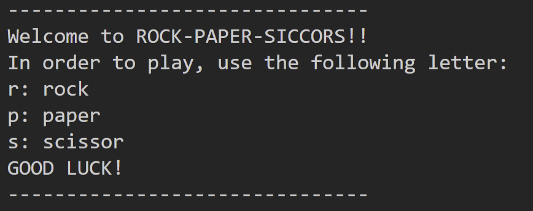
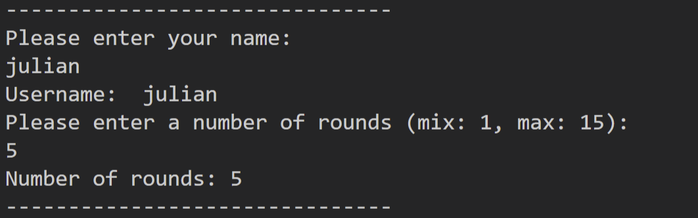
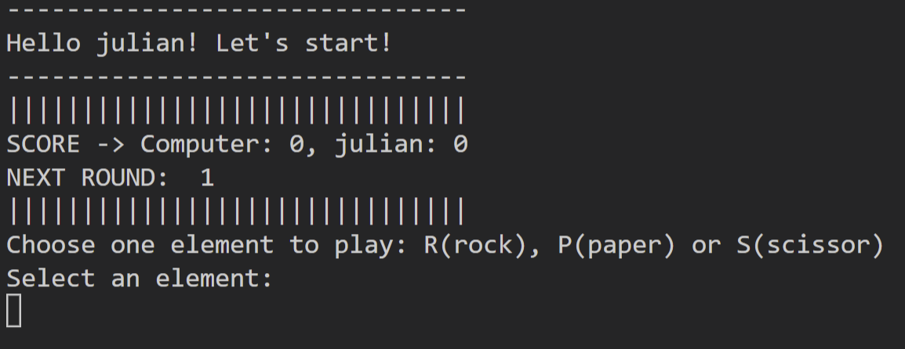
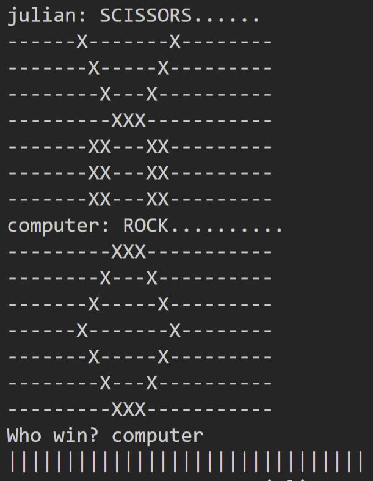

# Rock-Paper-Scissors

Rock-Paper-Scissors is a Python terminal game. I's been deployed on Heroki and runs in the Code Institute mock terminal.

Within this terminal, once users have run the program, they will can play to the clasic Rock, Paper and Scissors game against the computer.

Users must enter their user name and the number of rounds they want to play before start the game.

After playing the chosen rounds by the user, the final score will be printed out with the due winner. In order to restart the game, the program must be re-run again.

# Table of Contents

- [How to play](#how-to-play)
- [User Stories](#user-stories)
- [Features](#features)
- [Future features](#future-features)
- [Data Mode](#data-model)
- [Technologies](#technologies)
- [Testing](#testing)
- [Deployment](#deployment)
- [Credits](#credits)

## How to play

Rock, Paper and Scissor is the classic game everyone knows. Both players, at the same time, choose one of these 3 elements. Rock beats Scissor, Scissors beats Paper, and Paper beats Rocks.

In this version, the user enters their name and the number of rounds they like to play before starting the game.
Later on, the user must choose an element in every round, in order to play against the computer. By entering a 'r'/'R' in the shown input in the terminal, the Rock element is selected. A 'p'/'P' will select the Paper element and 's'/'S' will select the Scissor element.

In each round, the current round and the score will be shown. Once the game is over, the final Score nad the winner will be printed out. To play again the game, the user must re-run the program.

## User Stories

1. As an user I want to input my name and number of rounds I'd like to play before start the game.
2. As an user I want to see my score and who wins in each round.
3. As an user I want to see a sort of draw of the different elements (Rock, Paper and Scissors) when are selected by the user and the computer.
4. As an user I want to see the final score and who has won once the game is over.

## Features

- **Welcome**

  In this first feature a welcome message is displayed, where a short guidelines are shown.

  

- **Prestart the game**

  Here the two input where the user enter the pre-start-game information are shown.
  - The first input is to enter the user name.
  - The second input is where the user enter the maximum number of rounds they want to play in the game. This number must be greater than 1 and less than 15.

  

- **Game play**

  In this feature, a first message is printed out, greeting the user and encourage them to start.

  Then, the total score of the game and the next round to play are shown.

  Below, an input is displayed, where the user must enter the element they want to play in the next round.

  

- **Chosen elements**

  In this last feaure, a round of the game is shown.

  In the example below, a round of the game is shown where the user (julian) has chosen the Scissors element and the computer has chose the Rock element. For each element a different drawing is printed out, as in the example is given, where you can see a scissor and a rock printed.

  At the end of these drawings, the current round winner is also displayed.

  

## Future features

- One posible future feature might be to create sort of database in a Google Sheet, where all the scores of each match of each player are saved, in order to show a score rankings among all the players that have played with the application.
- Another posible future might be to improve the terminal output by adding colors.

## Data Model

I've decided to use a Game class with different methods and attributes to manage each game. The application creates one instance of this class each time a new game is started

The Game class stores the user name and the maximum number of roundes they have chosen. In addition, this class saves the game score and the final current round.

Two methods are also created in order to increment both variables mentioned before: the score and the current round.

## Technologies

- **Python** : it's a hig-level, interpreted programming language. Its design philosophy emphasizes code readability with the use of significant indentatition.
- **GitPod**: this tool has been chosen as the IDE of this project. It is a cloud development environment accessible via a browser, that can be run directly from the github repository.
- **Heroku**: It is a cloud platform as a service supporting several programming languages

## Testing

### Test cases and fixed bugs

- In order to pass all the User Stories tests, these are the steps that have been followed to test them:

  - User Story number 1:
    - The user must enter the user name input. This data must be between 1 and 15 characteres
    - The user must enter the number of rounds in a new input. This data must be a number between 1 and 15. 

    -> **Bugs found:** The user were able to enter an empty name. In order to fix this, a new validation has been done while entering the username data.
  
  - User Story number 2:
    - First print must show the current score of the game
    - A seccond print must give the current round.
    
    -> **Bugs found:** No bugs were found
  
  - User Story number 3:
    - The first print must display the chosen user element, with their name and the chosen element drawn.
    - The second print must display the chosen element by the computer.
    - A final message must appear, saying who has win that round.

    -> **Bugs found:** No bugs were found
  
  - User Story number 4:
    - One first print must show the final score of the game
    - A second print must show who has win the game.

    -> **Bugs found:** No bugs were found

### Code validation

- In order to validate the code, the tool has been used is [PEP8 Python Validator](http://pep8online.com/). After testing the code, the following are the errors found:

  

  All the errors encountered were solved by refactoring the specified lines.
  The validator was run again with the refactored code and no errors were found.

## Deployment

- The application has been deployed in Heroku. These are the steps that have been followd to deploy rock-paper-scissors:
  - First, sign up a new account in Heroku.
  - Once the account has been created, create a new app within Heroku (it gives us 5 free applications to create)
  - In this app, install two buildpacks in the settings secction: heroku/python and heroku/nodejs. These packs must be installed in that order.
  - Then, in the gitpod terminal of our code, run the following command: heroku_config. In here, enter the API key that is in the API Key section within Heroku.
  - After this, enter this command: **heroku git:remote -a <app_name>'. In the <app_name>** parameter, enter the name of the application has just been created.
  - Then, run this command if applicable: **git add . && git commit -m "Deploy to Heroku"**
  - Finally, run this two commands: **git push origin main** and **git push heroku main**.
  - If you get prompted to log in at any point, enter the heroku username and the API key.

## Credits

I like to thank my tutor, Rohit, for all the recommendations he has given me

### Content and Media

- Tips from [W3Schools](https://www.w3schools.com/) and [Stack Overflow](https://stackoverflow.com/).